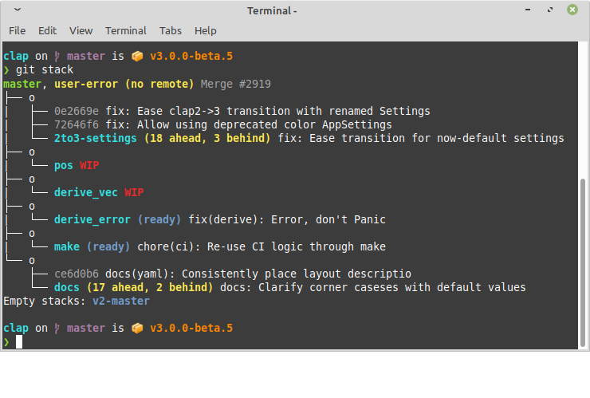

# git-stack

> **Stacked branch management for Git**



[](https://codecov.io/gh/epage/git-stack)
[][Documentation]

[](https://crates.io/crates/git-stack)

Dual-licensed under [MIT](LICENSE-MIT) or [Apache 2.0](LICENSE-APACHE)

## Documentation

- [About](#about)
- [Installation](#install)
- [Getting Started](#getting-started)
- [Reference](docs/reference.md)
- [FAQ](#faq)
- [Comparison](docs/comparison.md)
- [Contribute](CONTRIBUTING.md)
- [CHANGELOG](CHANGELOG.md)

## About

Like Stacked-Diffs? `git-stack` is [another approach](docs/comparison.md) to bringing the
[Stacked Diff workflow](https://jg.gg/2018/09/29/stacked-diffs-versus-pull-requests/)
to PRs that aims to be unintrusive to a project's workflow.  Branches are the unit
of work and review in `git-stack`.  As you create branches on top of each
other (i.e. "stacked" branches), `git-stack` will takes care of all of the
micromanagement for you.

Unfamiliar with Stacked-Diffs? `git-stack` helps automate a lot of common
workflows when dealing with PRs, especially when you start to create PRs on top
of PRs.

Features:
- Upstream parent branch auto-detection
- Maintain branches relative to each other through rebase
- Defers all permanent changes until the end (e.g. HEAD, re-targeting
  branches), always leaving you in a good state
  (similar to [`git revise`](https://github.com/mystor/git-revise/))
- Separates out pull/push remotes for working from a fork
- On `--push`, detects which branches are "ready" (e.g. root of stack, no WIP)
- Undo support: backs up branch state prior to rewriting history

Non-features
- Conflict resolution: `git-stack` will give up and you'll have to use
  `git rebase` yourself to resolve the conflict.

To see how `git-stack` compares to other stacked git tools, see the [Comparison](docs/comparison.md).

## Example

From your development branch, run:
```bash
jira-3423423 $ git-stack --pull
```

`git-stack`:
1. Auto-detects your parent remote branch (e.g. `main`).
2. Performs a `git pull --rebase <remote> <parent>`
3. Rebases `jira-3423423` (and any dev branches on the stack) onto `<parent>`
4. Shows the stacked branches

The closest equivalent is:
```bash
jira-3423 $ git checkout main
main $ git pull --rebase upstream main
main $ git checkout jira-3154
jira-3154 $ git rebase HEAD~~ --onto main
jira-3154 $ git checkout jira-3259
jira-3259 $ git rebase HEAD~ --onto jira-3154
jira-3259 $ git checkout jira-3423
jira-3423 $ git rebase HEAD~ --onto jurao-3259
jira-3423 $ git log --graph --all --oneline --decorate main..HEAD
```

*Parent branch auto-detection works by separating  the concept of
upstream-controlled branches (called "protected branches") and your development
branches.*

## Install

[Download](https://github.com/epage/git-stack/releases) a pre-built binary
(installable via [gh-install](https://github.com/crate-ci/gh-install)).

Or use rust to install:
```bash
cargo install git-stack
```

## Getting Started

### Configuring `git-stack`

**Protected branches:** These are branches like `main` or `v3` that `git-stack`
must not modify.  `git-stack` will also rebase local protected branches against
their remote counter parts.

Run `git-stack --protected -v` to test your config
- To locally protect additional branches, run `git-stack --protect <glob>`.
- When adopting `git-stack` as a team, you can move the protected branches from
  `$REPO/.git/config` to `$REPO/.gitconfig` and commit it.

**Pull remote** when working from a fork, where upstream is a different remote than
`origin`, run `git config --add stack.pull-remote <REMOTE>` to set your remote in `$REPO/.git/config`.

To see the config, run `git-stack --dump-config -`.

For more, see [Configuration Reference](docs/reference.md#configuration).

### Using

```bash
# Update branches against upstream
git-stack --pull

# Start a new branch / PR
git switch -c feature1
git add -A; git commit -m "Work"
git add -A; git commit -m "More Work"
git add -A; git commit --fixup HEAD~~

# See what this looks like
git-stack

# To push whats ready
git-stack --push
```

For more, see [Command Reference](docs/reference.md#commands).

## FAQ

### How do I stack another branch on top of an existing one?

- New branch: `git switch feature1 && git switch -c feature2` and start adding commits
- Moving existing: `git rebase HEAD~~ --onto feature1`
- Moving existing: `git-stack --rebase --base HEAD~~ --onto feature`

### How do I start a new feature?

This works like normal, just checkout the branch you want to base the feature on and start adding commits.

For example:
```bash
git switch feature1
git switch -c feature2
```

### How do I add a commit to a parent branch in a stack?

- If this is for fixing a problem in a previous commit,
  [`git commit --fixup <ref>`](https://git-scm.com/docs/git-commit#Documentation/git-commit.txt---fixupamendrewordltcommitgt)
  and then `git-stack --rebase` will move it to where it needs to be.
- If this is to append to the parent branch, for now you'll have to use `git rebase -i`

### How do I stack my PRs in Github?

Currently, Github is limited to showing all commits for a branch, even if some
of those commits are "owned" by another PR.  We recommend only posting one PR
at a time within a stack.  If you really need to, you can direct your reviewers
to the commits within each PR to look at.  However, you will see the CI run
status of top commit for each PR dependency.

## When is a commit considered WIP?

If a commit summary is only `WIP` or is prefixed by:
- `WIP:`
- `draft:`
- `Draft:`
- `wip `
- `WIP `

*This includes the prefixes used by [Gitlab](https://docs.gitlab.com/ee/user/project/merge_requests/drafts.html)*

### Why don't you just ...?

Have an idea, we'd love to [hear it](https://github.com/epage/git-stack/discussions)!
There are probably `git` operations or workflows we haven't heard of and would
welcome the opportunity to learn more.

[Crates.io]: https://crates.io/crates/git-stack
[Documentation]: https://docs.rs/git-stack
